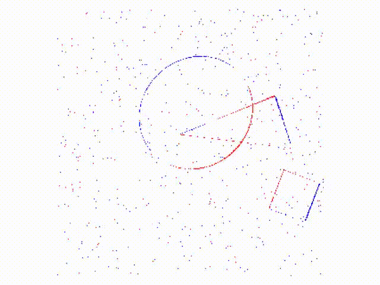

# GERD: Generated event response data generation


This repository contains code for generating event-based datasets for objects tracking tasks at arbitrary resolutions.
The primary purpose is to generate sparse frames consisting of events generated by the contour of objects subject to various transformations and noise.
The transformation of the shapes can be arbitrarily parameterized, which is useful to study the robustness of event-based algorithms to, for instance, different velocities and transformations.


Example render of shapes subject to affine transformation with a relatively high velocity (v=2.56).

## Important simulation details

We apply translation, scaling, rotation, and shearing to the shapes independently.
You can configure the transformations to use different starting conditions and the velocities will be updated according to a specified [PyTorch distribution](https://pytorch.org/docs/stable/distributions.html).
All of this is parameterized in the `RenderParameters` class in the [`render.py`](datasets/render.py) file.

### Activation normalization
Translation velocities are normalized to the pixel grid, meaning that a velocity of 1 in the x axis means that the object moves one pixel to the right every frame.
The other velocities are normalized to produce a similar number of pixel activations, to avoid skewing the dataset towards a specific transformation.

### Fractional velocities and upsampling
A velocity of 0.1 is obviously problematic in a pixel grid, why we use an upsampled grid that, by default, is 8 times the specified resolution.
An event in the downsampled (actual) grid will "trigger" when a certain fraction of the upsampled pixels are turned on.
To accumulate pixel activations in the upsampled grid over time, we use a thresholded integrator.

## Usage

The code is written in Python using the [PyTorch](https://pytorch.org/) library.
On a low level, we offer a general generating function `render` in the [`render.py`](datasets/render.py) file, that can render specific shapes, defined in [`shapes.py`](datasets/shapes.py).

On a higher level, the [`main.py`](datasets/main.py) file contains a script that generates a dataset of three specific objects moving in a scene: a square, a circle, and a triangle.
We will cover that usecase below:

### 1. Generating data

To generate a dataset, run the `main.py` file (see `python main.py --help` for more information).
The example below generates 1000 videos that translates and scales into the `/data` directory.

```bash
python main.py 1000 /data --translation --scaling --max_velocities 0.1 0.5 1.0
```

Note that the data is saved as a [sparse tensor](https://pytorch.org/docs/stable/sparse.html).

### 2. Using the generated dataset with PyTorch

We provide a PyTorch dataset class in the [`dataset.py`](datasets/dataset.py) file, which is straight-forward to use and only needs the path to the generated dataset as input.
Note that the dataset will output three tensors: a warmup tensor (for use in recurrent networks), an event tensor, and the object positions as labels. 

```python
from datasets.dataset import ShapeDataset

my_dataset = ShapeDataset("/data")
```

By default, the dataset will crop the frames to 40 timesteps and assume that each file contains 128 timesteps. 
You can change this by providing additional parameters to the `ShapeDataset` class.

## Authors

* [Jens E. Pedersen](https://www.kth.se/profile/jeped) (@GitHub [jegp](https://github.com/jegp/)), doctoral student at KTH Royal Institute of Technology, Sweden.
* [Raghav Singhal](https://github.com/RaghavSinghal10), visiting student at KTH Royal Institute of Technology, Sweden.

The work has received funding from the EC Horizon 2020 Framework Programme under Grant Agreements 785907 and 945539.

## Citation

If you use this work, please cite it as follows

```
@misc{Pedersen_Singhal_Conradt_2024,
  title={Event dataset generation for Galilean and affine transformations},
  url={https://zenodo.org/records/11063678}, 
  DOI={10.5281/zenodo.11063678}, 
  publisher={Zenodo}, 
  author={Pedersen, Jens Egholm and Singhal, Raghav and Conradt, Jörg}, 
  year={2024}, 
  month=apr
}
```